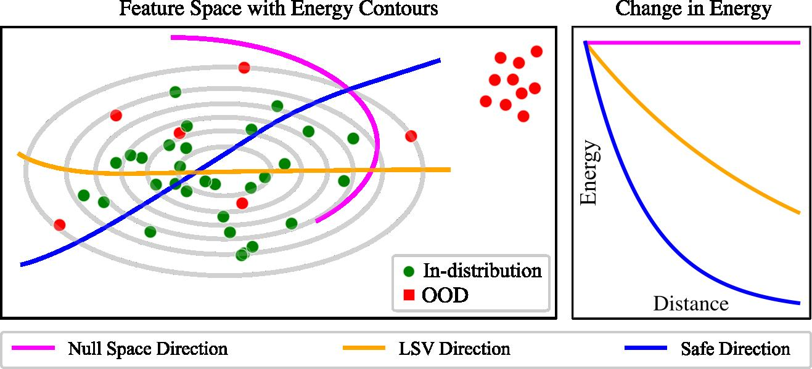

# FEVER-OOD: Free Energy Vulnerability Elimination for Robust Out-of-Distribution Detection
Implementation of [**FEVER-OOD**: **F**ree **E**nergy **V**ulnerability **E**limination for **R**obust **O**ut-**o**f-**D**istribution Detection](https://arxiv.org/abs/2412.01596) 
by [Brian Isaac-Medina](https://kostadinovshalon.github.io/), [Mauricio Che](https://sites.google.com/view/mauriciochemoguel/home), [Yona F.A. Gaus](https://yonafalinie.github.io/), [Samet Akcay](https://github.com/samet-akcay) and [Toby Breckon](https://breckon.org/breckon).
FEVER-OOD is a novel method for out-of-distribution detection 
that leverages free energy-based OOD detection methods, such as [VOS](https://github.com/deeplearning-wisc/vos) or [Dream-OOD](https://github.com/deeplearning-wisc/dream-ood), to eliminate the vulnerability of these methods 
to regions in the feature space that, while abnormal, are still labelled as in-distribution. The reduction of these regions
improve such free energy-based methods. We achieve state-of-the-art results when applying FEVER-OOD to Dream-OOD using the Imagenet-100 dataset as in-distribution.



This repository is based in the [VOS](https://github.com/deeplearning-wisc/vos) and [Dream-OOD](https://github.com/deeplearning-wisc/dream-ood) repositories, 
with some changes for compatibility between VOS and Dream-OOD, and the addition of the FEVER-OOD method. We keep the changelog in the [CHANGELOG.md](CHANGELOG.md) file.

## Contents
1. [Requirements](#requirements)
2. [FEVER-OOD - Classification](#fever-ood---classification)
    1. [In-Distribution Datasets](#in-distribution-datasets)
    2. [OOD Datasets](#ood-datasets)
    3. [Training](#training)
        1. [VOS/FFS](#vosffs)
        2. [Dream-OOD](#dream-ood)
    4. [Testing](#testing)
5. [FEVER-OOD - Object Detection](#fever-ood---object-detection)
    1. [Datasets](#datasets)
    2. [Training](#training-1)
    3. [Testing](#testing-1)
6. [Null Space Visualisation](#null-space-visualisation)
7. [Citation](#citation)

## Requirements 

The classification and object detection models are implemented in PyTorch. To use this code, setup an environment and then:

1. Install PyTorch and torchvision following the directions on the [official website](https://pytorch.org/).
2. Install the requirements using `pip install -r requirements.txt`.
3. Install [FrEIA](https://github.com/vislearn/FrEIA).
4_Object Deteciton Only_: Install Detectron2 using the official instructions [here](https://detectron2.readthedocs.io/en/latest/tutorials/install.html).

## FEVER-OOD - Classification

We train and evaluate VOS, FFS and Dream-OOD in the CIFAR10, CIFAR100 and Imagenet-100 datasets. The training and testing procedures are described below. All the code regarding classification is its corresponding directory. Enter the classification directory to run the classification code.
### In-Distribution Datasets
All the datasets are considered to be in a directory `<DATA-DIR>`.

#### CIFAR10 and CIFAR100
Download and extract the CIFAR10 and CIFAR100 datasets from the [official website](https://www.cs.toronto.edu/~kriz/cifar.html) and place them in `<DATA-DIR>/cifarpy`. The dir structure should be:

```
<DATA-DIR>
│
└───cifarpy
    │
    └───cifar-10-batches-py
    │
    └───cifar-100-python
```

#### Imagenet-100
Download and extract the Imagenet-1k dataset from [Kaggle](https://www.kaggle.com/c/imagenet-object-localization-challenge/overview/description) and place it in `<DATA-DIR>/imagenet-1k`.
Then create an `imagenet-100` directory and run the `classification/tools/create_imagenet-100.py` script inside of it, pointing to the downloaded imagenet-1k dataset. The dir structure should be:

```
<DATA-DIR>
│
└───imagenet-100
    │
    └───train
    │
    └───val
```

### OOD Datasets
For the CIFAR experiments, we follow the same procedure for the OOD datasets as in [here](https://github.com/deeplearning-wisc/npos?tab=readme-ov-file#out-of-distribution-dataset) (we don't use the LSUN-R dataset). The datasets are placed in `<DATA-DIR>/ood_datasets`, with the following structure:

``` 
<DATA-DIR>
│
└───dtd
    │
    └───images
    │
    └───imdb
    │
    └───labels
│
└───iSUN
    │
    └───iSUN_patches
│
└───LSUN_C
    │
    └───test
│
└───places365
    │
    └───test_samples
│
└───svhn
    │
    └───test_32x32.mat
```

For the Imagenet-100 experiments, we use the same OOD datasets as in [here](https://github.com/deeplearning-wisc/knn-ood?tab=readme-ov-file#out-of-distribution-dataset). The dir structure should be:

```
<DATA-DIR>
│
└───dtd
    │
    └───images
    │
    └───imdb
    │
    └───labels
│
└───SUN
    │
    └───images
│
└───Places
    │
    └───images
│
└───iNaturalist
    │
    └───test_samples
```

For Dream-OOD experiments, we use the generated CIFAR-100 and Imagenet-100 synthetic outliers from the [Dream-OOD](https://github.com/deeplearning-wisc/dream-ood).

### Training

#### VOS/FFS
Training involves the use of in-distribution data only. To train a VOS/FFS model, use the `classification/train-vos.py` script, with the following options:

```
train-vos.py [--dataset {cifar10,cifar100,imagenet-1k,imagenet-100}] [--data-root DATA_ROOT] [--model {wrn,rn34,rn50}] 
                    [--vos-start-epoch VOS_START_EPOCH] [--vos-sample-number VOS_SAMPLE_NUMBER] [--vos-select VOS_SELECT] [--vos-sample-from VOS_SAMPLE_FROM]
                    [--vos-loss-weight VOS_LOSS_WEIGHT] [--use_ffs] [--smin_loss_weight SMIN_LOSS_WEIGHT] [--use_conditioning] [--null-space-red-dim NULL_SPACE_RED_DIM] [<OTHER OPTIONS>]

Trains a Classifier with VOS/FFS for OOD Detection

optional arguments:
  --dataset {cifar10,cifar100,imagenet-1k,imagenet-100}
                        Choose between CIFAR-10, CIFAR-100, Imagenet-100, Imagenet-1k. (default: None)
  --data-root DATA_ROOT
                        Root for the dataset. (default: ./data)
  --model {wrn,rn34,rn50}, -m {wrn,rn34,rn50}
                        Choose architecture. (default: wrn)
  --vos-start-epoch VOS_START_EPOCH
                        Epoch to start VOS/FFS. (default: 40)
  --vos-sample-number VOS_SAMPLE_NUMBER
                        Number of samples to keep per class. (default: 1000)
  --vos-select VOS_SELECT
                        Number of least-likely samples to select from OOD samples. (default: 1)
  --vos-sample-from VOS_SAMPLE_FROM
                        Number of samplings to construct OOD samples. (default: 10000)
  --vos-loss-weight VOS_LOSS_WEIGHT
                        Weight for VOS loss. (default: 0.1)
  --use_ffs             Use FFS instead of VOS. (default: False)
  --smin_loss_weight SMIN_LOSS_WEIGHT
                        Weight for least singular value/conditioning number loss. (default: 0.0)
  --use_conditioning    Use conditioning number instead of least singular value. (default: False)
  --null-space-red-dim NULL_SPACE_RED_DIM
                        Dimensionality reduction for null space. (default: -1)

```
Other options are also available (please check the script for more information). For instance, to train FFS in the CIFAR-10 dataset with a Wide ResNet-40 model using a Null Space Reduction of 64 and Least Singular Value Regularizer, use the following command:

```
python train-vos.py --dataset cifar10 --model wrn --vos-loss-weight 0.1 --use_ffs --smin_loss_weight 0.1 --null-space-red-dim 64
```

#### Dream-OOD
Training Dream-OOD models involves using synthetic outliers generated from the in-distribution data. To train a Dream-OOD model, use the `classification/train-dream-ood.py` script, with the following options:

```
train-dream-ood.py [--dataset {cifar100,imagenet-100}] [--model {r34,r50}] 
                          [--energy_weight ENERGY_WEIGHT] [--smin_loss_weight SMIN_LOSS_WEIGHT] [--use_conditioning]
                          [--null-space-red-dim NULL_SPACE_RED_DIM] [--id-root ID_ROOT] [--ood-root OOD_ROOT] [<OTHER OPTIONS>]

Trains a Classifier with OOD Detection using Dream-OOD and FEVER-OOD

optional arguments:
  -h, --help            show this help message and exit
  --dataset {cifar100,imagenet-100}
                        Choose CIFAR-100 and Imagenet-100 (default: None)
  --model {r34,r50}, -m {r34,r50}
                        Choose architecture. (default: r50)
  --energy_weight ENERGY_WEIGHT
                        Energy regularization weight (default: 2.5)
  --smin_loss_weight SMIN_LOSS_WEIGHT
                        Weight for least singular value/conditioning number loss. (default: 0.0)
  --use_conditioning    Use conditioning number instead of least singular value. (default: False)
  --null-space-red-dim NULL_SPACE_RED_DIM
                        Dimensionality reduction for null space. (default: -1)
  --id-root ID_ROOT     Path to CIFAR-100 in-distribution training data (default: ./data/cifarpy)
  --ood-root OOD_ROOT   Path to OOD data (default: ./data/dream-ood-cifar-outliers)

```

FEVER-OOD related options are similar to VOS/FFS. Therefore, to train Dream-OOD in the Imagenet-100 dataset with a ResNet-34 using a Null Space Reduction of 114 and Conditioning Number Regularizer, use the following command:
    
```
python train-dream-ood.py --dataset imagenet-100 --model r34 --energy_weight 2.5 --use_conditioning --null-space-red-dim 114 --id-root ./<DATA-DIR>/imagenet-100 --ood-root ./<DATA-DIR>/<IN-OUTLIERS-DIR>
```
### Testing

Evaluating classification models is homogeneized for all datasets and methods. To test a model, use the `classification/test.py` script, with the following options:

```
test.py [--test_bs TEST_BS] [--num_to_avg NUM_TO_AVG] [--validate] [--use_xent] [--checkpoint CHECKPOINT] [--dataset {cifar10,cifar100,imagenet-1k,imagenet-100}] [--data-root DATA_ROOT] [--model {wrn,rn34,rn50}] [--ood-method {vos,dream-ood}] [--wrn-layers WRN_LAYERS]
               [--wrn-widen-factor WRN_WIDEN_FACTOR] [--wrn-droprate WRN_DROPRATE] [--ngpu NGPU] [--prefetch PREFETCH] [--out_as_pos] [--score SCORE] [--T T] [--noise NOISE] [--null-space-red-dim NULL_SPACE_RED_DIM]

Evaluates a CIFAR OOD Detector

optional arguments:
  --test_bs TEST_BS     Test Batch Size (default: 200)
  --num_to_avg NUM_TO_AVG
                        Average measures across num_to_avg runs. (default: 1)
  --validate, -v        Evaluate performance on validation distributions. (default: False)
  --use_xent, -x        Use cross entropy scoring instead of the MSP. (default: False)
  --checkpoint CHECKPOINT, -c CHECKPOINT
                        Checkpoint path to test. (default: None)
  --dataset {cifar10,cifar100,imagenet-1k,imagenet-100}
                        Choose between CIFAR-10, CIFAR-100, Imagenet-100, Imagenet-1k. (default: None)
  --data-root DATA_ROOT Data root directory (default: ./data)
  --model {wrn,rn34,rn50}, -m {wrn,rn34,rn50}
                        Choose architecture. (default: wrn)
  --ood-method {vos,dream-ood}
                        Choose OOD method. (default: vos)
  --wrn-layers WRN_LAYERS
                        total number of layers (default: 40)
  --wrn-widen-factor WRN_WIDEN_FACTOR
                        widen factor (default: 2)
  --wrn-droprate WRN_DROPRATE
                        dropout probability (default: 0.3)
  --ngpu NGPU           0 = CPU. (default: 1)
  --prefetch PREFETCH   Pre-fetching threads. (default: 2)
  --out_as_pos          OE define OOD data as positive. (default: False)
  --score SCORE {energy,Odin,M}         
                        score method. (default: energy)
  --T T                 temperature: energy|Odin (default: 1.0)
  --noise NOISE         noise for Odin (default: 0)
  --null-space-red-dim NULL_SPACE_RED_DIM 
                        Dimensionality reduction for null space. (default: -1)
```

For instance, to run the test script for a CIFAR-10 WideResNet model trained with VOS, use the following command:

```
python test.py --dataset cifar10 --model wrn --checkpoint <CHECKPOINT-PATH> --ood-method vos
```

To evaluate a Dream-OOD ResNet34 model with null space reduction of 114 in the Imagenet-100 dataset, use the following command:

```
python test.py --dataset imagenet-100 --model r34 --checkpoint <CHECKPOINT-PATH> --ood-method dream-ood --null-space-red-dim 114
```

## FEVER-OOD - Object Detection
Object detection-related models are trained and evaluated with Detectron2, following [VOS](https://github.com/deeplearning-wisc/vos) and [FFS](https://github.com/nish03/FFS). Additionally, this
repository combines both techniques into the same codebase, allowing to choose between both techniques. The main modifications are in [roihead_gmm.py](detection/modeling/roihead_gmm.py). Enter the detection directory to run the detection code.

### Datasets
We use the VOC dataset as in-distribution and test on the COCO and OpenImages datasets as OOD, with images containing overlapping VOC objects removed. Follow the [VOS](https://github.com/deeplearning-wisc/vos?tab=readme-ov-file#dataset-preparation) dataset instructions for detection.

### Training
We use the same training procedure as in VOS and FFS, with a few extra options regarding to FEVER-OOD. To train a VOC model, use the `detection/train.py` script, with the following options:

```
python train_net_gmm.py 
--dataset-dir path/to/dataset/dir
--num-gpus 1 
--config-file VOC-Detection/faster-rcnn/<MODEL>.yaml 
--random-seed 0 
--resume
```

Several example config files for VOS and FFS with FEVER-OOD are available in [detection/configs/VOC-Detection/faster-rcnn](detection/configs/VOC-Detection/faster-rcnn). The related VOS and FEVER-OOD options are given by the following options:

```
VOS:
  STARTING_ITER: 12000      # Iteration to start VOS
  SAMPLE_NUMBER: 75         # Number of samples to keep per class
  USE_FFS: True             # Use FFS instead of VOS 
  SAMPLE_FROM: 200          # Number of samplings to construct OOD samples
NULL_SPACE:
  RED_DIM: 768              # Dimensionality reduction for null space
  SMIN_LOSS_WEIGHT: 0.001   # Weight for least singular value/conditioning number loss
  USE_CONDITIONING: True    # Use conditioning number instead of least singular value
```

### Testing
Testing is carried out similar to VOS. First run the model through the in-distribution dataset:
```
python apply_net.py 
--dataset-dir path/to/dataset/dir
--test-dataset voc_custom_val 
--config-file VOC-Detection/faster-rcnn/<MODEL>.yaml 
--inference-config Inference/standard_nms.yaml 
--random-seed 0 
--image-corruption-level 0 
--visualize 0
```
From here you will obtain an object detection threshold that maximizes the F1-score, which will be used for obtaining the OOD metrics. 

Then run the model through the OOD dataset:
```
python apply_net.py
--dataset-dir path/to/dataset/dir
--test-dataset coco_ood_val 
--config-file VOC-Detection/faster-rcnn/<MODEL>..yaml 
--inference-config Inference/standard_nms.yaml 
--random-seed 0 
--image-corruption-level 0 
--visualize 0
```

And finally obtain the metrics using:
```
python voc_coco_plot.py 
--name vos 
--thres <DETECION-THR> 
--energy 1 
--seed 0
```

Where `<DETECTION-THR>` is the threshold obtained from the in-distribution dataset.

## Null Space Visualisation
We provide a script to create the visualisation of the feature space for a classification model trained in the CIFAR dataset. The script is located in the `classification/null_space_visualisation.py` directory. 
The script creates the figures 5 to 8 in the paper. The script uses the following options:

```
null_space_visualisation.py [--test_bs TEST_BS] [--dataset {cifar10,cifar100}] [--layers LAYERS] [--widen-factor WIDEN_FACTOR] [--drop_rate DROP_RATE] [--checkpoint CHECKPOINT] [--ngpu NGPU] [--prefetch PREFETCH] [--T T] [--noise NOISE] [--model_name MODEL_NAME] [--root ROOT]
                                   [--proj_method {tsne,umap}] [--null_space_red_dim NULL_SPACE_RED_DIM]

Visualize the features of a CIFAR OOD Detector

optional arguments:
  --test_bs TEST_BS     Test Batch Size (default: 200)
  --dataset {cifar10,cifar100}, -d {cifar10,cifar100}
  --layers LAYERS       total number of layers for the WideResNet architecture (default: 40)
  --widen-factor WIDEN_FACTOR
                        widen factor for the WideResNet architecture  (default: 2)
  --drop_rate DROP_RATE
                        dropout probability for the WideResNet architecture  (default: 0.3)
  --checkpoint CHECKPOINT
                        Checkpoint path to resume / test. (default: None)
  --ngpu NGPU           0 = CPU. (default: 1)
  --prefetch PREFETCH   Pre-fetching threads. (default: 2)
  --T T                 temperature: energy|Odin (default: 1.0)
  --noise NOISE         noise for Odin (default: 0)
  --model_name MODEL_NAME
                        Name of the model. Only the WideResNet architecture is available at the moment(default: wrn)
  --root ROOT           Data root directory (default: ./data)
  --proj_method {tsne,umap}
                        Projection method for the feature space. (default: tsne)
  --null_space_red_dim NULL_SPACE_RED_DIM
                        Dimensionality reduction for null space. (default: -1)
```

## Citation
You can cite this work as follows:

```
@article{isaac-medina24fever-ood, 
    author = {Isaac-Medina, B.K.S. and Che, M. and Gaus, Y.F.A. and Akcay, S. and Breckon, T.P.}, 
    title = {FEVER-OOD: Free Energy Vulnerability Elimination for Robust Out-of-Distribution Detection}, 
    journal={arXiv preprint arXiv:2412.01596}, 
    year = {2024}, 
    month = {December}
}
```

