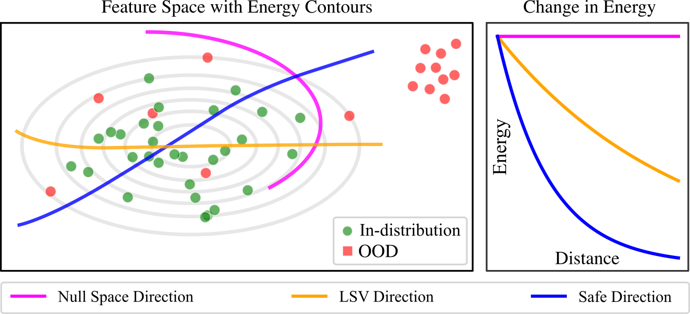
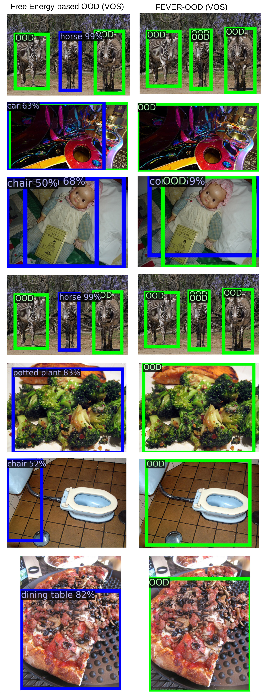
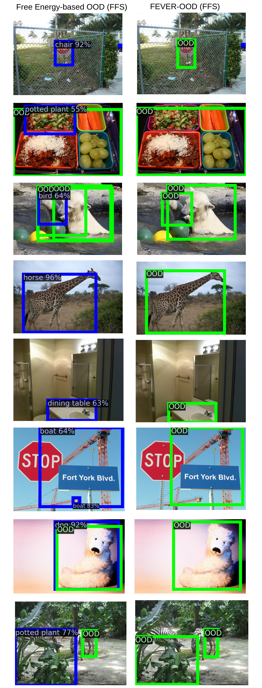
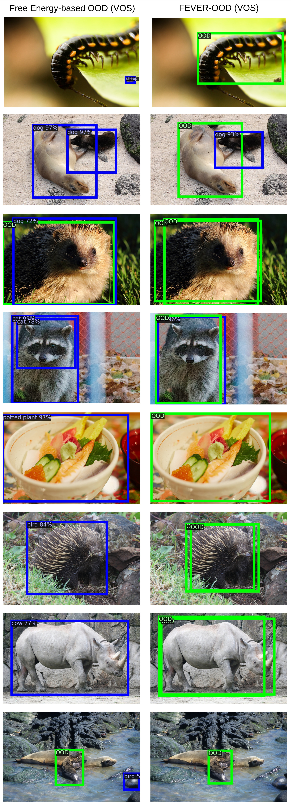
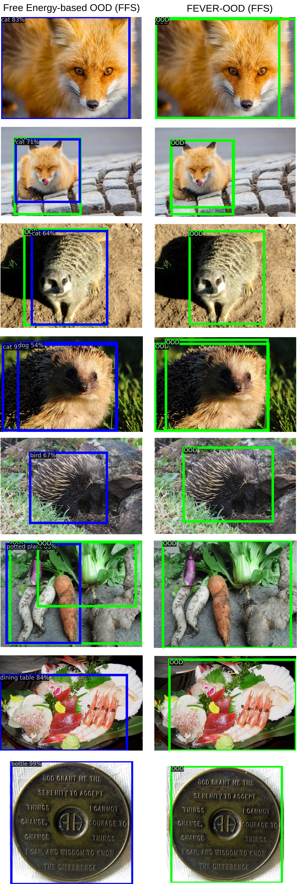

## Abstract

Modern machine learning models, that excel on computer vision tasks such as classification and object detection, are often overconfident in their predictions for Out-of-Distribution (OOD) examples, resulting in unpredictable behaviour for open-set environments. Recent works have demonstrated that the free energy score is an effective measure of uncertainty for OOD detection given its close relationship to the data distribution. However, despite free energy-based methods representing a significant empirical advance in OOD detection, our theoretical analysis reveals previously unexplored and inherent vulnerabilities within the free energy score formulation such that in-distribution and OOD instances can have distinct feature representations yet identical free energy scores. This phenomenon occurs when the vector direction representing the feature space difference between the in-distribution and OOD sample lies within the null space of the last layer of a neural-based classifier. To mitigate these issues, we explore lower-dimensional feature spaces to reduce the null space footprint and introduce novel regularisation to maximize the least singular value of the final linear layer, hence enhancing inter-sample free energy separation. We refer to these techniques as Free Energy Vulnerability Elimination for Robust Out-of-Distribution Detection (FEVER-OOD). Our experiments show that FEVER-OOD techniques achieve state of the art OOD detection in Imagenet-100, with average OOD false positive rate (at 95% true positive rate) of 35.83% when used with the baseline Dream-OOD model.

[//]: # ()

## Results

  

    
1 / 4

    

        
        

            <h4>ID:PASCAL VOC, OOD:MSCOCO</h4>
        

    

  

  

    
2 / 4

    

        
        

            <h4>ID:PASCAL VOC, OOD:MSCOCO</h4>
        

    

  

    
3 / 4

    

        
        

            <h4>ID:PASCAL VOC, OOD:OpenImages</h4>
        

    

  

    
4 / 4

    

        
        

            <h4>ID:PASCAL VOC, OOD:OpenImages</h4>
        

    

  

  <!-- Next and previous buttons -->
  <a class="prev" onclick="plusSlides(-1)">&#10094;</a>
  <a class="next" onclick="plusSlides(1)">&#10095;</a>

 

<!-- The dots/circles -->

  
  
  
  

## Citation
    
    @article{isaac-medina24fever-ood, 
    author = {Isaac-Medina, B.K.S. and Che, M. and Gaus, Y.F.A. and Akcay, S. and Breckon, T.P.}, 
    title = {FEVER-OOD: Free Energy Vulnerability Elimination for Robust Out-of-Distribution Detection}, 
    journal={arXiv preprint arXiv:2412.01596}, 
    year = {2024}, 
    month = {December}, }
    